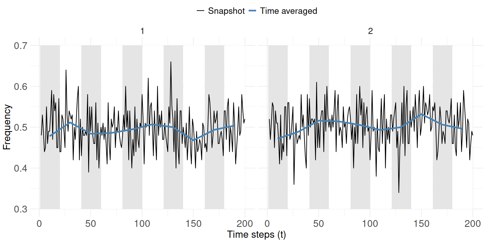

```{r setup, include = FALSE}
knitr::opts_chunk$set(
  warning = FALSE,
  message = FALSE,
  collapse = TRUE,
  comment = "#>"
)
```

# Beyond the Signals of Selection: A simulation-based analysis of the Frequency Increase Test applied to archaeological data

## Outline

-   [Overview](#Overview)
-   [Quick start](#Quick-start)
-   [Methods](#Methods)
-   [Reproduce experiments](#Reproduce-experiments)
-   [Further remarks](#Further-remarks)
-   [Final remark](#Final-remark)
-   [Contributing](#Contributing)
-   [Acknowledgments](#Acknowledgments)

## Overview {#overview}

This repo includes all scripts, figures and tables created to carry out the analysis of the paper [**INSERT TITLE**], submitted to the [**INSERT JOURNAL**]. The aim of this project is to critically assess the performance of the core statistical component of the [`signatselect`](https://github.com/benmarwick/signatselect), the **Frequency Increase Test (FIT)**.

Neutrality tests, such as the Ewens-Watterson and [Slatkin's exact test](https://github.com/mmadsen/slatkin-exact-tools), have yielded insightful results to archaeological data. However, the nature of the archaeological record and cultural evolution raises critical questions about the inferences from these tests: Does departure from neutrality always mean selection? Can cultural transmission biases equate to selection? How reliable are these tests given the poor time resolution of archaeological assemblages?

We address this gap by evaluating the `signatselect` (SST), a statistical method designed to detect selection in genetic time series data [Feder et al. (2014)](https://doi.org/10.1534/genetics.113.158220). It is a computationally efficient technique, employing a one-sample *t*-test (the Frequency Increase Test, FIT) to compare the rescaled allele frequency differences between two successive intervals against Wright-Fisher theoretical expectations. It requires at least three time points (the **three-time-point** rule), and it flags selection at $\alpha$ = 0.05.

Its efficiency for archaeological time series, shaped by evolutionary and depositional processes, remains untested. Thus, our research has three objectives:

-   To evaluate neutral detection and Type I error rate (false positives) under unbiased transmission.
-   To appraise its statistical power (SSR) when variants undergo selection via two cultural transmission biases: content and conformist bias.
-   To critically gauge the confounding effect of temporal structure of assemblages (i.e., time averaging) on the test’s performance.

## Quick start {#quick-start}

### Installation

```{r install packages but not run, eval=FALSE}
# Install required packages for the whole analysis
install.packages(c("dplyr","ggplot2","tidyr","gridExtra",
                   "purrr","tibble","writexl","pak","tidyverse",
                   "viridis","stringr","viridisLite",
                   "readxl","patchwork","scales"))

# Install signatselect
pak::pkg_install("benmarwick/signatselect")
```

```{r load-packages, message=FALSE, warning=FALSE}
# Read packages using lapply()
pkgs <- c(
  "dplyr","ggplot2",
  "tidyr","gridExtra","purrr",
  "tibble","writexl", "tidyverse",
  "viridis", "stringr", "viridisLite",
  "readxl", "patchwork", "scales"
)
invisible(lapply(pkgs, library, character.only = TRUE))

# Read signatselect
library(signatselect)
```

## Methods {#methods}

We conduct two simulation-based experiments modelling cultural transmission. Both use base parameters: population size (`N`), innovation rate (`μ`), a burn-in period (`B`), discrete time units (`t`), and time window size (`w`) for averaging. Thus, we simulate three transmission models:

1.  **Unbiased transmission**: naive individuals randomly adopt a variant from the population.
2.  **Content-biased transmission**: learners are more likely to adopt a variant with a higher "attractiveness" product (1 + `b`).
3.  **Frequency-biased transmission**: learners are more likely to adopt a variant the more common it becomes, modeled with a conformist exponent (1 + `c`).

Each experiment is paired with two temporal deposition schemes: a **snapshot** regime (fine-grained ideal deposition), and **time-averaging** regime (coarse-grained, palimpsest deposition).





## Reproduce experiments {#reproduce-experiments}

In order to reproduce the results reported in the dissertation the user should refer to two types of [scripts](https://github.com/Cooperr18/FIT_culttransm_arch/tree/master/scripts) and the following workflow:

1.  Script storing the functions defining the models and baseline parameters. Firstly, define the function of each model, and run the baseline levels at the end of the same script. The folder [Experiment A](https://github.com/Cooperr18/FIT_culttransm_arch/tree/master/scripts/Experiment_A) contains two .R files whose name refers to the model. E.g., [`Unbiased_Time_Averaged.R`](https://github.com/Cooperr18/FIT_culttransm_arch/blob/master/scripts/Experiment_A/Unbiased_Time_Averaged.R) contains the model of unbiased transmission paired with time averaging. Within the folder [Experiment_B](https://github.com/Cooperr18/FIT_culttransm_arch/tree/master/scripts/Experiment_B) you can find the content and conformist biased transmission models with their respective time schemes.


2.  Script including the lists of parameter combinations, and the specific function to run each set of parameters. These are named simply as `Experiment_A.R` and `Experiment_B.R`, and contain the code to reproduce the experiments, given that the functions with the models are already in the environment (I suggest working as a project).


3. The data included in the tables is stored in the folder [data](https://github.com/Cooperr18/FIT_culttransm_arch/tree/master/data), structured hierarchically: `model_timescheme_output`. There are additional spreadsheets which are not strictly derived from the code within this repo. This is because they come from older versions of the models, pulled from the original repo used in my dissertation, found [here](https://github.com/Cooperr18/Dissertation-Code).


4. The figures used in the article can be accessed in the folder [figures](https://github.com/Cooperr18/FIT_culttransm_arch/tree/master/figures), and the code to reproduce the figures is included in an R file named [`figures.R`](https://github.com/Cooperr18/FIT_culttransm_arch/blob/master/scripts/figures.R). Full indications on how to achieve the same figures are given within the R script.


### Experiment 1

In Experiment 1, we simulate neutral conditions under both deposition schemes, [`Unbiased_Snapshot.R`](https://github.com/Cooperr18/FIT_culttransm_arch/blob/master/scripts/Experiment_A/Unbiased_Snapshot.R) and [`Unbiased_Time_Averaging.R`](https://github.com/Cooperr18/FIT_culttransm_arch/blob/master/scripts/Experiment_A/Unbiased_Time_Averaged.R), defined by the lines:

```{r, eval=FALSE}
# Time averaging step
    averaged_rows <- floor(timesteps / time_window) # round down to nearest whole number
    # list of time-averaged samples (each is a vector of N * time_window variants)
    averaged_samples <- vector("list", averaged_rows)
    for (j in 1:averaged_rows) {
      start <- (j - 1) * time_window + 1
      end <- j * time_window
      # Flatten all traits in the time window into one vector
      averaged_samples[[j]] <- as.vector(traitmatrix[start:end, ])
    }
    
    unique_variants <- sort(unique(unlist(averaged_samples))) # store unique variants across all bins
```

At equilibrium, we record the variants and run the FIT over multiple iterations:

```{r, eval=FALSE}
# Trait matrix to frequency matrix (row = bins, col = variants)
    freq_mat <- t(sapply(averaged_samples, function(variants) {
      tab <- table(factor(variants, levels = unique_variants))
      as.numeric(tab) / length(variants)  # Proportions relative to N * time_window
    }))
    colnames(freq_mat) <- unique_variants
    
    # Prepare FIT input
    freq_long <- as.data.frame(freq_mat) %>%
      mutate(time = 1:nrow(.)) %>%
      pivot_longer(-time, names_to="variant", values_to="freq") %>% # long format
      filter(freq > 0) %>% # remove zeros
      mutate(variant = as.integer(variant))
    
    # Filter data to 3 time points
    freq_long_filtered <- freq_long %>%
      group_by(variant) %>%
      filter(n_distinct(time) >= 3) %>%
      ungroup()
    
    # FIT application and storing
    if (nrow(freq_long_filtered)==0) {
      fit_results <- tibble(
        variant     = integer(),
        time_points = integer(),
        fit_p       = double(),
        sig         = character()
      )
    } else {
      fit_results <- freq_long_filtered %>%
        group_split(variant) %>%
        map_dfr(~ {
          df <- as.data.frame(.x)  # .x is a dataframe
          
          # check if we have enough data points
          if (nrow(df) < 3) {
            return(data.frame(variant = df$variant[1], time_points = nrow(df), fit_p = NA, stringsAsFactors = FALSE))
          }
          
          # safely apply FIT
          res <- tryCatch(
            fit(time = df$time, v = df$freq),
            error = function(e) list(fit_p = NA)  # handle errors
          )
          
          data.frame(
            variant = df$variant[1],
            time_points = nrow(df),
            fit_p = res$fit_p,
            stringsAsFactors = FALSE
          )
        }) %>%
        mutate(
          sig = case_when(
            is.na(fit_p) ~ "NA",
            fit_p > p_value_lvl ~ "neutral",
            TRUE  ~ "selection"
          )
        )
    }
```


We then calculate the Neutral Detection Rate or `NDR` (True Negatives) and the Type I Error Rate (or False Positive Rate, `FPR`):

```{r, eval=FALSE}
# p-value count
    fit_p_count[[run]] <- fit_results$fit_p
    
    # Store metrics
    total_variants <- sum(fit_results$sig != "NA")
    FPR <- sum(fit_results$sig == "selection") / total_variants  # False positives
    NDR <- sum(fit_results$sig == "neutral") / total_variants     # True negatives
    
    if(total_variants == 0) { # if no variants survive NA is returned
      FPR <- NA; NDR <- NA
    }
    
    accuracy_ta[run] <- NDR  # track NDR across runs
    FPR_ta[run] <- FPR
  }
  
  # Store results
  # MEAN
  mean_accuracy <- mean(accuracy_ta, na.rm = TRUE) # mean accuracy across runs
  high_accuracy_runs <- sum(accuracy_ta >= 0.95) / n_runs * 100
  mean_FPR <- mean(FPR_ta, na.rm = TRUE)
  
  # SD
  sd_NDR <- sd(accuracy_ta, na.rm = T) # sd across runs
  sd_FPR <- sd(FPR_ta, na.rm = T)
  
  all_pvals <- unlist(fit_p_count)
  
  # Proportion of NA from the simulation
  sumNA <- sum(is.na(all_pvals))
  proportionNA <- sumNA / length(all_pvals) * 100
  if(sumNA == 0) {
    proportionNA <- 0
  }
  
  # Store output
  return(list(
    
    # PARAMETERS
    N = N,
    mu = mu,
    burnin = burnin,
    timesteps = timesteps,
    p_value_lvl = p_value_lvl,
    n_runs = n_runs,
    time_window = time_window,
    
    # OUTPUT
    accuracy_ta = accuracy_ta,
    mean_accuracy = mean_accuracy,
    mean_FPR = mean_FPR,
    sd_NDR = sd_NDR,
    sd_FPR = sd_FPR,
    high_accuracy_runs = high_accuracy_runs,
    sumNA = sumNA,
    proportionNA = proportionNA,
    fit_p_count = fit_p_count,
    all_pvals = all_pvals
    )
  )
}
```


and run through different parameter combinations, defined in [`Experiment_1.R`](https://github.com/Cooperr18/FIT_culttransm_arch/blob/master/scripts/Experiment_A/Experiment_1.R). For example:

```{r, eval=FALSE}
######## EXPERIMENT 1 #########

set.seed(1234)

# NEUTRAL SNAPSHOT -------------------------------------------------------------

# Innovation rate
n_snap_mu_params <- list(
  list(N=100, mu=0.01, burnin=1000, timesteps=1000, p_value_lvl=0.05, n_runs=1000),
  list(N=100, mu=0.025, burnin=1000, timesteps=1000, p_value_lvl=0.05, n_runs=1000),
  list(N=100, mu=0.05, burnin=1000, timesteps=1000, p_value_lvl=0.05, n_runs=1000),
  list(N=100, mu=0.075, burnin=1000, timesteps=1000, p_value_lvl=0.05, n_runs=1000),
  list(N=100, mu=0.1, burnin=1000, timesteps=1000, p_value_lvl=0.05, n_runs=1000),
  list(N=100, mu=0.125, burnin=1000, timesteps=1000, p_value_lvl=0.05, n_runs=1000),
  list(N=100, mu=0.15, burnin=1000, timesteps=1000, p_value_lvl=0.05, n_runs=1000),
  list(N=100, mu=0.175, burnin=1000, timesteps=1000, p_value_lvl=0.05, n_runs=1000),
  list(N=100, mu=0.2, burnin=1000, timesteps=1000, p_value_lvl=0.05, n_runs=1000)
)

# Run and store

# INNOVATION RATE (MU)
n_snap_mu_results <- map_dfr(n_snap_mu_params, ~ {
  sim <- do.call(neutral_snapshot, args = .x)
  tibble(N  = .x$N,
         mu = .x$mu,
         burnin = .x$burnin,
         timesteps = .x$timesteps,
         "α" = .x$p_value_lvl,
         "NDR" = round(sim$mean_accuracy, 3),
         "%NA" = round(sim$proportionNA, 2),
         "Runs" = .x$n_runs
  )
})
write_xlsx(n_snap_mu_results, "tables/n_snap_output/n_snap_mu_params.xlsx") # mu
```


### Experiment 2

In Experiment 2, we introduce one focal variant with a content or conformist bias at equilibrium, as described by the models in [`Content_Bias_Snapshot.R`](https://github.com/Cooperr18/FIT_culttransm_arch/blob/master/scripts/Experiment_B/Content_Bias_Snapshot.R), [`Content_Bias_Time_Averaging.R`](https://github.com/Cooperr18/FIT_culttransm_arch/blob/master/scripts/Experiment_B/Content_Bias_Time_Averaging.R). To ensure the focal survives 3 time points 5% of the times:

```{r, eval=FALSE}
# compute minimal inject count to ensure focal survives >= 3 time points
  if (is.null(inject_override)) {
    inject_fvar <- ceiling(N * (1 - p_extinct^(1 / (2 * N))))
  } else {
    inject_fvar <- inject_override
  }
```

And then we apply the content bias at equilibrium:
```{r, eval=FALSE}
# Define focal variant label after burn-in to avoid innovation collision
    sel_variant_snap <- maxtrait + 1
    results_snap$variant[run] <- sel_variant_snap
    
    # Inject focal variant in t = 1
    pop[1:inject_fvar] <- sel_variant_snap        
    maxtrait  <- sel_variant_snap
    traitmatrix[1, ] <- pop 
    
    # Observation period after equilibrium
    for (gen in 2:timesteps) {
      
      # apply content biased transmission
      a <- ifelse(pop == sel_variant_snap, 1 + b, 1) # selected variant weighs 1 + s, neutral = 1
      pop <- sample(pop,replace=T,prob = a) # add the weights as probabilities
```


With [`Conformist_Bias_Snapshot.R`](https://github.com/Cooperr18/FIT_culttransm_arch/blob/master/scripts/Experiment_B/Conformist_Bias_Snapshot.R) and [`Conformist_Bias_Time_Averaging.R`](https://github.com/Cooperr18/FIT_culttransm_arch/blob/master/scripts/Experiment_B/Conformist_Bias_Time_Averaging.R), instead of injecting the focal variant with a probability of survival, we pick the modal variant at equilibrium, and apply the bias:

```{r, eval=FALSE}
# Define focal variant as the most common
    tab <- table(pop)
    sel_variant_snap <- as.integer(names(tab)[ which.max(tab) ])
    results_snap$variant[run] <- sel_variant_snap
    
    # record t = 1
    traitmatrix[1, ] <- pop 
    
    # Observation period after equilibrium
    for (gen in 2:timesteps) {
      
      # conformist biased transmission
      counts <- tabulate(pop, nbins = maxtrait) # get counts for all variants
      w_var <- counts^(1 + c) # assign normalized weight to all variants:
      a <- w_var[pop] # give each individual its variant's weight
      # sample next generation
      pop <- sample(pop,N,replace=T,prob = a) # add the weights as probabilities
```

We then follow the same procedure as before ([`Experiment_2.R`](https://github.com/Cooperr18/FIT_culttransm_arch/blob/master/scripts/Experiment_B/Experiment_2.R)), and compute the Signal of Selection Rate (statistical power, `SSR`) and the Type II Error Rate (or False Negative Rate, `FNR`):

```{r, eval=FALSE}
# p-value count
    fit_p_count[[run]] <- fit_results$fit_p
    
    this_fit <- fit_results %>% 
      filter(variant == sel_variant_snap) # call the focal variant
    
    # Avoid length-zero 
    p_value <- this_fit$fit_p[1] 
    if (is.null(p_value) || length(p_value) == 0) {
      p_value <- NA_real_
    }
    
    # assign inference
    inf <- case_when(
      is.na(p_value) ~ NA_character_,
      p_value > 0.05 ~ "neutral",
      TRUE ~ "selection" # if non of the previous, selection
    ) 
    
    # Store both across runs
    results_snap$fit_p[run]  <- p_value
    results_snap$inference[run] <- inf
  }
  
  # Summarise output
  sel <- sum(results_snap$inference == "selection", na.rm = T)
  neut <- sum(results_snap$inference == "neutral", na.rm = T)
  sumNA <- sum(is.na(results_snap$inference))
  
  SSR <- sel / (n_runs - sumNA)
  FNR <- neut / (n_runs - sumNA)
  proportionNA <- sumNA / n_runs
  all_pvals <- unlist(fit_p_count)
  
  # Export output
  return(list(
    sel_variant_snap = sel_variant_snap, # variant
    
    # parameters
    N = N,
    mu = mu,
    c = c,
    burnin = burnin,
    timesteps = timesteps,
    p_value_lvl = p_value_lvl,
    n_runs = n_runs,
    
    # outputs
    all_pvals = all_pvals,
    SSR = SSR,
    sumNA = sumNA,
    FNR = FNR,
    proportionNA = proportionNA,
    fit_p_count = fit_p_count,
    fit_results = fit_results, # global results
    results_snap = results_snap # focal variant results
  )
  )
}
```


Both experiments are run with a base parameter set:

```{r, eval=FALSE}
# CONFORMIST BIASED TRANSMISSION, BASELINE SIMULATION
conf_snap_sim <- conformist_bias_snapshot(N = 500, mu = 0.01, burnin = 1000, c = 0.1,
                                          timesteps = 50, p_value_lvl = 0.05, n_runs = 500)

# Store output across runs in a table
results_table_conf_snapshot <- tibble(
  N  = conf_snap_sim$N,
  "µ" = conf_snap_sim$mu,
  c = conf_snap_sim$c,
  "Burn-in" = conf_snap_sim$burnin,
  "Time steps" = conf_snap_sim$timesteps,
  "α" = conf_snap_sim$p_value_lvl,
  SSR = conf_snap_sim$SSR,
  FNR = conf_snap_sim$FNR,
  proportionNA = conf_snap_sim$proportionNA,
  "Runs" = conf_snap_sim$n_runs
)

print(results_table_conf_snapshot)
write_xlsx(results_table_conf_snapshot, "tables/conf_snap_output/conf_snap_baseline.xlsx")
```

followed by parameter sweeps to observe the confounding effect of each parameter to the test’s ability to flag selection. This approach allows us to capture the interaction between cultural evolution and assemblage formation, helping us pin down potential confounding agents in the archaeological record.

## Further remarks {#further-remarks}

To provide full transparency of the decision-making process along the realization of this work, refer to the [`Report of daily progress.docx`](https://github.com/Cooperr18/Dissertation-Code/blob/master/Report%20of%20daily%20progress.docx) in the repo used for the dissertation, from which this paper departs. It is a diary that shows full accountability for both included and not included decisions in the final project. For instance, [`Scrap_Models`](https://github.com/Cooperr18/FIT_culttransm_arch/tree/master/scripts/Scrap_Models) stores alternative approaches to modeling content bias.


## Final remark {#final-remark}

This investigation is driven by the lack of systematic research of the `signatselect` in archaeology. There are few sources which explore the scope of this technique: the original publication, [Feder et al. (2014)](https://doi.org/10.1534/genetics.113.158220); an application to language time series data [Newberry et al. (2017)](https://doi.org/10.1038/nature24455); a brief overview of softwares to detect selection [Vlachos et al. (2020)](https://doi.org/10.1186/s13059-019-1770-8), and an evaluation of Newberry et al.'s results plus the effect of time binning on the test [Karjus et al. (2019)](https://doi.org/10.5334/gjgl.909). However, the only source which explicitly applies and evaluates the `signatselect` with archaeological data is a public repo posted by Ben Marwick, Hezekiah A. Bacovcin and Sergey Kryazhimskiy, at <https://github.com/benmarwick/signatselect>. This source has served of great inspiration to this study, thus I am truly thankful to the authors.

## Contributing {#contributing}

We welcome contributions. Please:

1.  Fork the repository
2.  Create a feature branch (`git checkout -b amazing-feature`)
3.  Commit your changes (`git commit -m "Add amazing feature"`)
4.  Push to the branch (`git push origin amazing-feature`)
5.  Open a Pull Request

## Acknowledgments {#acknowledgments}

I am grateful to my supervisor, [Dr. Enrico Crema](https://ercrema.github.io/), for his unwavering encouragement, combined with his superb coding expertise and keen insights into the literature, all of which have profoundly benefited my work. In addition, I appreciate his patient guidance in helping me improve my coding and analytical skills, which have grown significantly under his mentorship. Moreover, I am thankful for the guidance and inspiration provided by [Dr. Daniel García Rivero](https://investigacion.us.es/sisius/sis_showpub.php?idpers=8645), for I owe him much of my interest in evolutionary archaeology.

I also thank Ben Marwick, Hezekiah Akiva Bacovcin and Sergey Kryazhimskiy for their contributions in the application of the [`signatselect`](https://github.com/benmarwick/signatselect) to archaeological data,which served as a great initial push for this work. Finally, to the HES and BAS cohort, and to Justin and Jose, for easing this sometimes rather steep climb and putting up with my complaints.